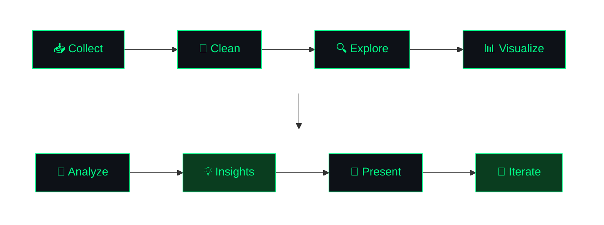

<!-- ════════════════════════════════════════════════════════ HEADER ══ -->

&nbsp;&nbsp;
&nbsp;&nbsp;

<!-- ════════════════════════════════════════════════════ ABOUT ME ══ -->

## `> About Me`

I am a Data Analyst who turns raw data into clear, useful insights. I work across the full analytics pipeline — data cleaning, SQL, visualization, and machine learning — with a focus on solving real business problems.

Currently building my skills through hands-on projects and professional training, with a goal of contributing to a team where data drives decisions.

 

<!-- ════════════════════════════════════════════════════ SKILLS ══════ -->

## `> Technical Skills`

<table>
  <tr>
    <td align="center" width="150"><b>Programming</b></td>
    <td>
      &nbsp;
      
    </td>
  </tr>
  <tr>
    <td align="center"><b>Data Analysis</b></td>
    <td>
      &nbsp;
      &nbsp;
      &nbsp;
      
    </td>
  </tr>
  <tr>
    <td align="center"><b>Database</b></td>
    <td>
      &nbsp;
      &nbsp;
      
    </td>
  </tr>
  <tr>
    <td align="center"><b>Visualization</b></td>
    <td>
      &nbsp;
      &nbsp;
      
    </td>
  </tr>
  <tr>
    <td align="center"><b>Statistics</b></td>
    <td>
      &nbsp;
      
    </td>
  </tr>
  <tr>
    <td align="center"><b>Tools</b></td>
    <td>
      &nbsp;
      &nbsp;
      &nbsp;
      &nbsp;
      
    </td>
  </tr>
</table>

 

<!-- ════════════════════════════════════════════ FEATURED PROJECT ══ -->

## `> Featured Project`

<table align="center" border="1" width="96%">
<tr><td padding="30">

<h2>SmartStock AI</h2>

Retail Inventory Analytics &amp; Decision Support

 

&nbsp;&nbsp;

 

> A retail inventory analytics system that uses historical sales data to forecast demand, identify stockout risk, and generate restocking recommendations — delivered through a Streamlit dashboard with an AI-powered assistant.

**Key Capabilities -**

- Stores and updates retail data in **PostgreSQL**
- Forecasts next-day demand using a **Random Forest** model
- Detects stockout risk and generates restocking recommendations
- Uses the **Gemini API** to explain results in plain language

 

**Technology Stack**

&nbsp;
&nbsp;
&nbsp;
&nbsp;
&nbsp;
&nbsp;
&nbsp;
&nbsp;

</td></tr>
</table>

 

<!-- ════════════════════════════════════════ CURRENTLY LEARNING ══ -->

## `> Currently Learning`

- **Advanced Python** — writing cleaner, more efficient analytical code
- **Data Analytics** — end-to-end workflows and storytelling with data
- **SQL** — window functions and query optimization
- **Machine Learning** — model evaluation and feature engineering
- **AI-assisted development** — using AI tools effectively in a professional workflow

 

<!-- ═════════════════════════════════ PROFESSIONAL DEVELOPMENT ══ -->

## `> Professional Development`

**SURE ProEd (SURE TRUST) — Data Analytics Internship**

SmartStock AI is my capstone project from the **SURE ProEd Data Analytics Internship**. The program covered data preparation, SQL, Python, machine learning, and dashboard development. I also completed the **PAWR (Professional & AI Workplace Readiness) Program** — focused on building workplace skills and technical competence in an AI-integrated environment.

 

&nbsp;&nbsp;

 

<!-- ══════════════════════════════ WHERE DATA MEETS INTELLIGENCE ══ -->

## `> Turning Data into Insights `

> The universal process — every Data Analyst, every project, everywhere.

 

**What It Actually Looks Like** — *the honest version*

| Step | The Reality No One Tells You |
|:---:|:---|
| 📥 **Collect** | *"The data is ready."* &nbsp;—&nbsp; Spoiler: it never is. |
| 🧹 **Clean** | This IS the job. 80% of your time. Nobody warned you. |
| 🔍 **Explore** | *"Why is this column 70% empty?! Who approved this?!"* |
| 📊 **Visualize** | Make it pretty enough that stakeholders stop asking questions. |
| 🤖 **Analyze** | Find patterns. Or spend 3 hours questioning your entire career. |
| 💡 **Insights** | 3 seconds of clarity after 3 days of staring at a screen. |
| 📢 **Present** | *"Great work! Can we get this as a pie chart though?"* |
| 🔄 **Iterate** | Back to step 1. Always. Forever. This is the way. |

 

